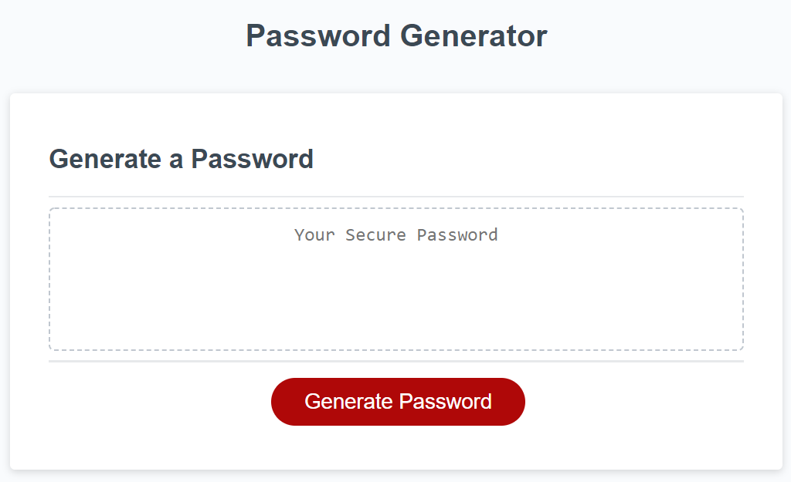
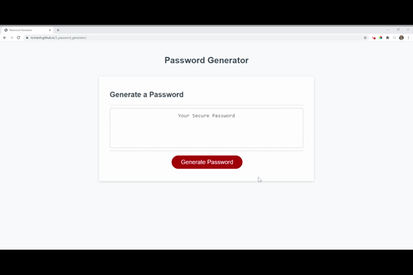

# Password Generator

The Password Generator creates a random and secure password based upon user input. 

## Table of Contents

1. [Usage](#Usage)
1. [Languages and Concepts](#Languages-and-Concepts)
1. [Method](#Method)
1. [Demo](#Demo)
1. [Roadmap](#Roadmap)
1. [Links](#Links)
1. [Contributing](#Contributing)
1. [License](#License)

## Usage

If a user is in need of a secure password, using a Password Generator such as this will allow them to customize and create a random (and secure) password. They will be able to choose the length of their password and what types of characters they would like to include.

Having a longer, random password with a variety of characters increases the strength and security of said password, making it more difficult for hackers to break in.

## Languages and Concepts

- JavaScript
- HTML
- CSS

## Method

1. Having quite a few steps and specifications to add in, I first lined out the pathway that I wanted to follow to create the code in pseudocode notes on my .js file.
1. Then I started working on the generatePassword function. I created the variables needed along with their associated prompts/confirms to be able to collect the user input which would begin the password creation process. I had the console.log collect each of these values to ensure that each question was working properly.
1. Next, I made an array for each of the selections : lowercase letters, uppercase letters, numbers, and special characters. At this time, I changed the names of the variables to something simpler than what I originally had done. I then created an empty array to eventually pool together the chosen character sets. Taking my 4 sets of selection arrays, I made a new variable for each using the .split method so that each character was its own element within the array. Then I wrote an if statement so that if the user selected the character set ( === true), then it would .push(...) the character set array into the joined pool array.
1. Near the end of the function, I created a new, empty array. For this array, I made a for loop to grab random elements from within the pooled array, and set it to repeat the number of times equal to the length of the password chosen by the user. At this point, I had an array of random characters, and  I used the .join("") method to take it out of the array, make them into one string and to take that value and return it as the newPassword in the display box.
1. Now that I had a working application, I wanted to try to refine it. I added a while loop to loop if the user does not select a number between 8-128.
1. I added an if statement for the user to try again if they did not select any character sets. This takes the user back to the main page.
1. Lastly, I added the isNaN() method to the while loop for the length input so that it will loop if the user inputs something that is not a number.

Give it a try!

## Demo

## Roadmap

To advance this Password Generator, there are a couple different pathways that I could explore: 
- Adding a timer for the password/console log to clear itself to increase the security of the generated password
- Adding in a link to a password manager
- Making it more interactive, like a scratch and reveal feature to make it more fun (but maybe with a toggle to hide this in case the user means business and just needs a password or multiple passwords)
- Create a way to generate multiple passwords at once in case the user is needing it for multiple users or multiple temporary passwords, for example
- Add in multiple languages

## Links

- [Project Repository](https://github.com/ncmarsh/3_password_generator)
- [Password Generator](https://ncmarsh.github.io/3_password_generator/)

### Contributing

This is a personal project; no contributions are required at this time.

### License

No license granted.

##### [Return to Top of Page](#Password-Generator)